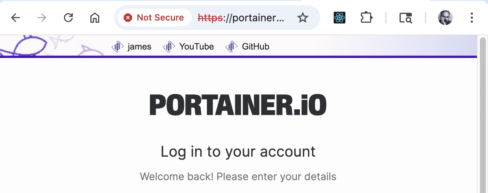

# Centralized Bookmark Bar Chrome Extension

This browser extension injects a customizable bookmark bar into web pages, displaying bookmarks fetched from a central server (http://bookmarks.applebaum.treehouse/bookmarks.json). The bar can be
excluded from certain networks/domains via the config.js file.
The bar contains a checkbox to toggle the visibility of the bookmarks that has a persistant cookie.


## Browser Extention - Installation Instructions

Follow these steps to install the extension in Chrome:

1. **Clone or Download the Extension**
    - Download or clone this repository to your local machine.

2. **Open Chrome Extensions Page**
    - Go to `chrome://extensions/` in your Chrome browser.

3. **Enable Developer Mode**
    - Toggle the "Developer mode" switch in the top right corner.

4. **Load Unpacked Extension**
    - Click the "Load unpacked" button.
    - Select the folder containing the extension files (the folder with `manifest.json`).

5. **Verify Installation**
    - The extension should now appear in your list of extensions.
    - Visit a site on an allowed network/domain (e.g., 192.168.100.*, 10.0.100.*, or *.applebaum.treehouse) to see the bookmark bar.

6. **Central Bookmarks Server**
    - Ensure your bookmarks server is running and accessible **_(you must be local or connected to our VPN)_** at `http://bookmarks.applebaum.treehouse/bookmarks.json`.
    - The JSON file must be valid and follow the format described below.

## **Central Bookmarks Server Setup**

**http://bookmarks.applebaum.treehouse/bookmarks.json**

### bookmarks.json Format

The `bookmarks.json` file should be hosted at `http://bookmarks.applebaum.treehouse/bookmarks.json` and must be a valid JSON array. Each element in the array represents a bookmark and should be an
object with the following properties:

- `label` (string, required): The display name of the bookmark.
- `iconUrl` (string, optional): The URL of the icon to display for this bookmark. If omitted, the extension's default icon will be used.
- `url` (string, optional): The URL to open when the bookmark is clicked. (Note: You may want to add click handling in the extension if you want this feature.)


## [Current Centralized Bookmark Bar JSON File](bookmarks.json)

- The `iconUrl` can be any valid image URL (local or remote). If omitted, the extension will use its bundled icon.
- The `url` property is optional, but recommended if you want bookmarks to be clickable (requires click handler in the extension).

## Notes

- The extension will only display the bookmark bar on allowed networks/domains:
    - IPs starting with `192.168.100.*` or `10.0.100.*`
    - Hostnames ending with `applebaum.treehouse`
- Make sure your server at `bookmarks.applebaum.treehouse` is accessible from your local network.
- The JSON file must be valid and served with the correct MIME type (`application/json`).

## JSON List Example

To create a dropdown in the bookmark bar, add an object with `type: "dropdown"` and an `options` array. Each option should have a `label` and a `value`.

### Example bookmarks.json with Dropdown

```json
[
  {
    "label": "james",
    "iconUrl": "http://bookmarks.applebaum.treehouse/icons/james.png",
    "url": "https://intranet.applebaum.treehouse/profile/james"
  },
  {
    "type": "dropdown",
    "label": "Dev Links",
    "iconUrl": "http://bookmarks.applebaum.treehouse/icons/management.png",
    "options": [
      {
        "label": "YouTube",
        "value": "https://youtube.com",
        "iconUrl": "https://bookmarks.applebaum.treehouse/EBP-Browser-Bookmark-Bar/icons/video@16x.png"
      },
      {
        "label": "GitHub",
        "value": "https://github.com/Electric-Bluefish-Productions-Inc",
        "iconUrl": "https://bookmarks.applebaum.treehouse/EBP-Browser-Bookmark-Bar/icons/git@16x.png"
      },
      {
        "label": "Docs",
        "value": "https://docs.applebaum.treehouse"
        // No iconUrl: will use default icon
      }
    ]
  }
]
```

- The dropdown will appear as a select list with the provided options.
- You can mix normal bookmarks and dropdowns in the same JSON array.
- You may add click/change handling in the extension to open the selected link when a dropdown option is chosen.

## Firefox Compatibility

To support Firefox, we added browser-polyfill.js as a web accessible resource and included it in your content scripts.
